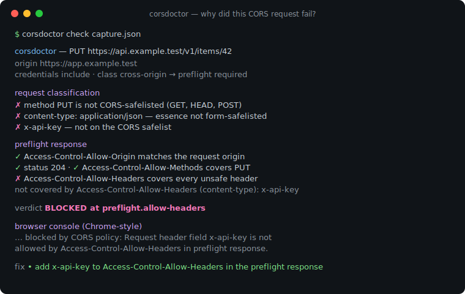
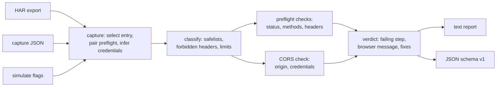

# corsdoctor

[English](README.md) | [中文](README.zh.md) | [日本語](README.ja.md)

[](LICENSE) [](go.mod) [](CHANGELOG.md)  [](CONTRIBUTING.md)

**corsdoctor：CORS リクエストがなぜ失敗するのかを正確に説明する、オープンソースで依存ゼロの CLI —— キャプチャしたリクエストとレスポンスの上で Fetch 標準の CORS アルゴリズムを実行し、失敗したステップを名指しし、ブラウザのコンソールエラーを再現し、修正方法を提示する。**



```bash
git clone https://github.com/JaydenCJ/corsdoctor && cd corsdoctor
go build -o corsdoctor ./cmd/corsdoctor    # single static binary, stdlib only
```

> プレリリース：v0.1.0 はまだどのパッケージレジストリにも公開されていません。上記の手順でソースからビルドしてください（Go ≥1.22 であれば可）。

## なぜ corsdoctor？

「Blocked by CORS policy」は Web 開発で最も検索されるエラーなのに、その周辺のツールは驚くほど浅い。ブラウザのコンソールは*どれかのチェックが失敗した*ことは教えてくれるが、*どの入力が*失敗させたのかは教えてくれない。`curl -v` はヘッダーを見せてくれるが、アルゴリズムはあなたの頭の中に残ったままで、細部こそが落とし穴になる —— `Access-Control-Allow-Origin` は*シリアライズされた* origin とバイト単位で比較される、資格情報が絡んだ瞬間に `*` はリテラルになる、`PATCH` は決して大文字化されない、`Authorization` はヘッダーのワイルドカードの対象外、リダイレクトはどんなヘッダーが付いていてもプリフライトを殺す。オンラインの CORS チェッカーは*自分自身の*リクエストを送るので、診断されるのは彼らのトラフィックであってあなたのものではない。corsdoctor は実際に起きたもの —— DevTools の HAR、手書きの JSON キャプチャ、あるいは CLI フラグ —— を受け取り、ブラウザが実行するのと同じ分類・プリフライト・CORS チェックのアルゴリズムをステップごとに実行し、ブラウザが止まった場所で止まる。判定は失敗した具体的なチェックを Fetch 標準の出典付きで名指しし、Chrome 風のコンソールメッセージを再現して見たものと一致するか確認でき、サーバーが送るべきヘッダーを印字する。さらに、実リクエストが一度も送られなかった HAR でも、失敗したプリフライトの `Access-Control-Request-*` ヘッダーからリクエストを再構築して診断できる。

| | corsdoctor | ブラウザコンソール | curl -v + 目視 | オンライン CORS チェッカー |
|---|---|---|---|---|
| 本物の Fetch CORS アルゴリズムを実行 | ✅ | ✅（不透明） | ❌ | 部分的 |
| 失敗ステップの名指し + 仕様の出典 | ✅ | ❌ | ❌ | ❌ |
| 値レベルのプリフライト分類（content-type essence、128/1024 バイト上限） | ✅ | ❌ | ❌ | ❌ |
| *あなたの*トラフィックのキャプチャからオフラインで動作 | ✅ | n/a | ✅ | ❌ 自前で送信 |
| 資格情報モードを認識（`*` のリテラル化、`true` の大文字小文字規則） | ✅ | ✅ | ❌ | 部分的 |
| 失敗したプリフライトからリクエストを再構築（HAR） | ✅ | ❌ | ❌ | ❌ |
| 機械可読な判定 + スクリプト向け終了コード | ✅ | ❌ | ❌ | ❌ |
| ランタイム依存 | 0 | n/a | 0 | ブラウザ + 先方のサーバー |

<sub>依存数の確認日 2026-07-13：corsdoctor は Go 標準ライブラリのみを import する（`go.mod` に require ブロックなし）。</sub>

## 特徴

- **ヘッダー lint ではなくアルゴリズム** —— Fetch のリクエスト分類・CORS プリフライト・CORS チェックを、名前と順序を持つステップとして実装。判定は `BLOCKED at preflight.allow-headers` であり、「どこかおかしい」ではない。
- **値レベルのプリフライトトリガー** —— あるヘッダーが*なぜ*プリフライトを強制するのかを知っている：`content-type` の MIME essence 規則、言語バイト集合、単一範囲の `Range`、128 バイトの値上限と 1024 バイトの合計上限、そして決してカウントされないブラウザ専有ヘッダー。
- **origin 不一致を構造的に診断** —— 末尾スラッシュ、スキーム、ポート（デフォルトポート省略を含む）、ホストの大文字小文字、サブドメイン混同、そして 2 層のミドルウェアがそれぞれ `Access-Control-Allow-Origin` を付ける重複ヘッダーの罠。
- **ブラウザメッセージの再現** —— すべての blocked 判定に Chrome 風のコンソールエラーが付くので、DevTools で見たものとバイト単位で照合でき、診断が*あなたの*失敗を捉えたと確信できる。
- **手元にあるものを読む** —— DevTools の HAR エクスポート（プリフライト自動ペアリング、資格情報の推定、失敗プリフライトからの再構築付き）、最小限で手書き可能なキャプチャ JSON、または `simulate` の純フラグで「もし〜なら」を問える。
- **判定だけでなく修正と危険信号も** —— 具体的な修正行（定番の「ミドルウェアが OPTIONS しか装飾していない」バグを含む）に加え、`Vary: Origin` の欠落、`null` origin の許可、古い `Access-Control-Max-Age` キャッシュへの警告。
- **依存ゼロ、完全オフライン** —— Go 標準ライブラリのみ。キャプチャがマシンの外に出ることはない。テレメトリなし、ネットワーク通信は一切なし。

## クイックスタート

```bash
go build -o corsdoctor ./cmd/corsdoctor
./corsdoctor check examples/blocked-preflight-header.json
```

実際のキャプチャ出力：

```text
corsdoctor — PUT https://api.example.test/v1/items/42
  origin       https://app.example.test
  credentials  include (cookies / Authorization sent)
  class        cross-origin → preflight required

request classification
  ✗ method PUT is not CORS-safelisted (GET, HEAD, POST)
  ✓ accept: application/json — safelisted
  ✗ content-type: application/json — MIME essence "application/json" is not application/x-www-form-urlencoded, multipart/form-data, or text/plain
  ✗ x-api-key: k-123 — the name is not on the CORS safelist (accept, accept-language, content-language, content-type, range)
  → the browser sends OPTIONS first with Access-Control-Request-Headers: content-type, x-api-key

preflight response
  ✓ Access-Control-Allow-Origin is present
      Access-Control-Allow-Origin: https://app.example.test
  ✓ Access-Control-Allow-Origin matches the request origin
      byte-for-byte match with "https://app.example.test"
  ✓ Access-Control-Allow-Credentials permits credentials
      Access-Control-Allow-Credentials: true
  ✓ preflight response status is ok (2xx)
      status 204
  ✓ Access-Control-Allow-Methods covers the method
      PUT is listed (Access-Control-Allow-Methods: PUT, PATCH, DELETE)
  ✗ Access-Control-Allow-Headers covers every unsafe header
      not covered by Access-Control-Allow-Headers (content-type): x-api-key
      ref: Fetch "CORS-preflight fetch" headers check: every CORS-unsafe request-header name must be covered; "*" never covers Authorization and is literal with credentials

actual response
  – CORS check on the actual response
      the browser never sends the actual request when the preflight fails

verdict  BLOCKED at preflight.allow-headers
  not covered by Access-Control-Allow-Headers (content-type): x-api-key

browser console (Chrome-style)
  Access to fetch at 'https://api.example.test/v1/items/42' from origin 'https://app.example.test' has been blocked by CORS policy: Request header field x-api-key is not allowed by Access-Control-Allow-Headers in preflight response.

fix
  • add x-api-key to Access-Control-Allow-Headers in the preflight response
```

まだキャプチャがない？「もし〜なら」を直接尋ねて、サーバーが満たすべき契約を得られる（`simulate`、実出力）：

```text
$ ./corsdoctor simulate --origin https://app.example.test \
    --url https://api.example.test/items --method DELETE \
    -H 'X-Api-Key: k1' --credentials

corsdoctor — DELETE https://api.example.test/items
  origin       https://app.example.test
  credentials  include (cookies / Authorization sent)
  class        cross-origin → preflight required

request classification
  ✗ method DELETE is not CORS-safelisted (GET, HEAD, POST)
  ✗ x-api-key: k1 — the name is not on the CORS safelist (accept, accept-language, content-language, content-type, range)
  → the browser sends OPTIONS first with Access-Control-Request-Headers: x-api-key

verdict  ADVISORY
  no responses captured — listing what the server must send for this request to pass

server requirements
  • answer `OPTIONS` with a 2xx (no redirect) carrying `Access-Control-Allow-Origin: https://app.example.test` and `Access-Control-Allow-Credentials: true`
  • the preflight must list the method: `Access-Control-Allow-Methods: DELETE`
  • the preflight must cover the unsafe headers: `Access-Control-Allow-Headers: x-api-key`
  • the actual DELETE response itself needs `Access-Control-Allow-Origin: https://app.example.test` and `Access-Control-Allow-Credentials: true`
```

## CLI リファレンス

`corsdoctor [check|simulate|version] …` —— 素のパスは `check` として扱われる。終了コード：0 許可/助言、1 ブロック、2 用法エラー、3 キャプチャ不完全。

| フラグ | デフォルト | 効果 |
|---|---|---|
| `check <file\|->` | — | キャプチャ JSON または HAR（自動判別）、または標準入力を診断 |
| `--json` | オフ | 安定した機械可読レポート（`schema_version: 1`）、`exit_code` 付き |
| `--url <substring>`（check） | 最初のエントリ | 診断する HAR エントリを選択 |
| `--credentials` / `--no-credentials` | キャプチャ由来 | 資格情報モードを強制（HAR 推定を上書き） |
| `--origin`、`--url`（simulate） | 必須 | リクエスト元ページの origin と対象 URL |
| `--method`、`-H 'Name: value'`（simulate） | `GET`、なし | 分類するリクエスト |
| `--preflight-status`、`--preflight-header`（simulate） | なし | OPTIONS レスポンスを付与 |
| `--status`、`--response-header`（simulate） | なし | 実レスポンスを付与 |

入力フォーマットは [docs/capture-format.md](docs/capture-format.md) に、各チェックと失敗コードは [docs/checks.md](docs/checks.md) に記載。

## 検証

このリポジトリに CI は付属しない。上記の主張はすべてローカル実行で検証される：

```bash
go test ./...            # 89 deterministic tests, offline, < 5 s
bash scripts/smoke.sh    # end-to-end CLI check, prints SMOKE OK
```

## アーキテクチャ



## ロードマップ

- [x] v0.1.0 —— Fetch に忠実な分類 + プリフライト + CORS チェックとステップ単位の判定、HAR/JSON/simulate 入力、失敗プリフライトの再構築、Chrome メッセージ出力、text/JSON レポート、89 テスト + smoke スクリプト
- [ ] Private Network Access チェック（`Access-Control-Allow-Private-Network`）
- [ ] `Timing-Allow-Origin` と `Cross-Origin-Resource-Policy` の診断
- [ ] `corsdoctor fix` —— そのまま貼れるサーバー設定を生成（nginx、Express、Go net/http）
- [ ] 生の HTTP メッセージ入力（JSON の代わりにリクエスト/レスポンステキストを貼り付け）
- [ ] WebSocket ハンドシェイク（`Origin` チェック）アドバイザー

完全なリストは [open issues](https://github.com/JaydenCJ/corsdoctor/issues) を参照。

## コントリビュート

Issue・ディスカッション・PR を歓迎します —— ローカルのワークフロー（format、vet、テスト、`SMOKE OK`）は [CONTRIBUTING.md](CONTRIBUTING.md) を参照。入門向けタスクは [good first issue](https://github.com/JaydenCJ/corsdoctor/issues?q=is%3Aissue+is%3Aopen+label%3A%22good+first+issue%22) というラベルが付き、設計の議論は [Discussions](https://github.com/JaydenCJ/corsdoctor/discussions) で行われます。

## ライセンス

[MIT](LICENSE)
