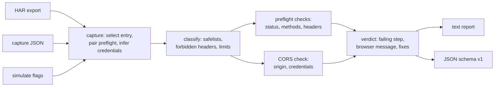

# corsdoctor

[English](README.md) | [中文](README.zh.md) | [日本語](README.ja.md)

[](LICENSE) [](go.mod) [](CHANGELOG.md)  [](CONTRIBUTING.md)

**corsdoctor：an open-source, zero-dependency CLI that explains exactly why a CORS request fails — it runs the Fetch-standard CORS algorithm over a captured request and response, names the failing step, reconstructs the browser's console error, and prescribes the fix.**


```bash
git clone https://github.com/JaydenCJ/corsdoctor && cd corsdoctor
go build -o corsdoctor ./cmd/corsdoctor    # single static binary, stdlib only
```

> Pre-release: v0.1.0 is not tagged on a package registry yet; build from source as above (any Go ≥1.22).

## Why corsdoctor?

"Blocked by CORS policy" is the most googled error in web development, and the tooling around it is remarkably shallow. The browser console tells you *that* a check failed but not *which inputs* made it fail; `curl -v` shows you headers but leaves the algorithm in your head, where the details go wrong — that `Access-Control-Allow-Origin` is compared byte-for-byte against a *serialized* origin, that `*` turns literal the moment credentials are involved, that `PATCH` is never uppercased, that `Authorization` is exempt from the header wildcard, that a redirect kills a preflight regardless of its headers. Online CORS checkers send *their own* live request, so they diagnose their traffic, not yours. corsdoctor takes what actually happened — a HAR from DevTools, a hand-written JSON capture, or CLI flags — and executes the same classification, preflight, and CORS-check algorithm a browser runs, step by step, stopping where the browser stopped. The verdict names the exact failing check with its Fetch-standard citation, reproduces the Chrome-style console message so you can confirm it matches what you saw, and prints the header the server must send. It even diagnoses HARs where the real request never happened, by rebuilding it from the failed preflight's `Access-Control-Request-*` headers.

| | corsdoctor | browser console | curl -v + eyeballs | online CORS testers |
|---|---|---|---|---|
| Runs the actual Fetch CORS algorithm | ✅ | ✅ (opaque) | ❌ | partially |
| Names the failing step + spec citation | ✅ | ❌ | ❌ | ❌ |
| Value-level preflight classification (content-type essence, 128/1024-byte limits) | ✅ | ❌ | ❌ | ❌ |
| Works offline from a capture of *your* traffic | ✅ | n/a | ✅ | ❌ sends its own |
| Credentials-mode aware (`*` turning literal, `true` case rules) | ✅ | ✅ | ❌ | partially |
| Reconstructs the request from a failed preflight (HAR) | ✅ | ❌ | ❌ | ❌ |
| Machine-readable verdict + exit codes for scripts | ✅ | ❌ | ❌ | ❌ |
| Runtime dependencies | 0 | n/a | 0 | a browser + their server |

<sub>Dependency count checked 2026-07-13: corsdoctor imports the Go standard library only (`go.mod` has no require block).</sub>

## Features

- **The algorithm, not a header lint** — implements Fetch's request classification, CORS-preflight fetch, and CORS check as named, ordered steps; the verdict is `BLOCKED at preflight.allow-headers`, not "something looks off".
- **Value-level preflight triggers** — knows *why* a header forces a preflight: MIME essence rules for `content-type`, language byte sets, single-range `Range`, the 128-byte value and 1024-byte aggregate limits, and browser-owned headers that never count.
- **Origin mismatches diagnosed structurally** — trailing slash, scheme, port (with default-port elision), host case, subdomain confusion, and the duplicated-header trap where two middleware layers each add `Access-Control-Allow-Origin`.
- **Browser-message reconstruction** — every blocked verdict includes the Chrome-style console error, so you can byte-compare it with what DevTools showed you and know the diagnosis found *your* failure.
- **Reads what you already have** — DevTools HAR exports (with automatic preflight pairing, credential inference, and failed-preflight reconstruction), a minimal hand-writable capture JSON, or pure flags via `simulate` for what-if questions.
- **Fixes and hazards, not just verdicts** — concrete fix lines (including the classic "your middleware only decorates OPTIONS" bug), plus warnings for missing `Vary: Origin`, `null`-origin allowances, and stale `Access-Control-Max-Age` caches.
- **Zero dependencies, fully offline** — Go standard library only; captures never leave your machine. No telemetry, no network, ever.

## Quickstart

```bash
go build -o corsdoctor ./cmd/corsdoctor
./corsdoctor check examples/blocked-preflight-header.json
```

Real captured output:

```text
corsdoctor — PUT https://api.example.test/v1/items/42
  origin       https://app.example.test
  credentials  include (cookies / Authorization sent)
  class        cross-origin → preflight required

request classification
  ✗ method PUT is not CORS-safelisted (GET, HEAD, POST)
  ✓ accept: application/json — safelisted
  ✗ content-type: application/json — MIME essence "application/json" is not application/x-www-form-urlencoded, multipart/form-data, or text/plain
  ✗ x-api-key: k-123 — the name is not on the CORS safelist (accept, accept-language, content-language, content-type, range)
  → the browser sends OPTIONS first with Access-Control-Request-Headers: content-type, x-api-key

preflight response
  ✓ Access-Control-Allow-Origin is present
      Access-Control-Allow-Origin: https://app.example.test
  ✓ Access-Control-Allow-Origin matches the request origin
      byte-for-byte match with "https://app.example.test"
  ✓ Access-Control-Allow-Credentials permits credentials
      Access-Control-Allow-Credentials: true
  ✓ preflight response status is ok (2xx)
      status 204
  ✓ Access-Control-Allow-Methods covers the method
      PUT is listed (Access-Control-Allow-Methods: PUT, PATCH, DELETE)
  ✗ Access-Control-Allow-Headers covers every unsafe header
      not covered by Access-Control-Allow-Headers (content-type): x-api-key
      ref: Fetch "CORS-preflight fetch" headers check: every CORS-unsafe request-header name must be covered; "*" never covers Authorization and is literal with credentials

actual response
  – CORS check on the actual response
      the browser never sends the actual request when the preflight fails

verdict  BLOCKED at preflight.allow-headers
  not covered by Access-Control-Allow-Headers (content-type): x-api-key

browser console (Chrome-style)
  Access to fetch at 'https://api.example.test/v1/items/42' from origin 'https://app.example.test' has been blocked by CORS policy: Request header field x-api-key is not allowed by Access-Control-Allow-Headers in preflight response.

fix
  • add x-api-key to Access-Control-Allow-Headers in the preflight response
```

No capture yet? Ask a what-if question and get the server's contract (`simulate`, real output):

```text
$ ./corsdoctor simulate --origin https://app.example.test \
    --url https://api.example.test/items --method DELETE \
    -H 'X-Api-Key: k1' --credentials

corsdoctor — DELETE https://api.example.test/items
  origin       https://app.example.test
  credentials  include (cookies / Authorization sent)
  class        cross-origin → preflight required

request classification
  ✗ method DELETE is not CORS-safelisted (GET, HEAD, POST)
  ✗ x-api-key: k1 — the name is not on the CORS safelist (accept, accept-language, content-language, content-type, range)
  → the browser sends OPTIONS first with Access-Control-Request-Headers: x-api-key

verdict  ADVISORY
  no responses captured — listing what the server must send for this request to pass

server requirements
  • answer `OPTIONS` with a 2xx (no redirect) carrying `Access-Control-Allow-Origin: https://app.example.test` and `Access-Control-Allow-Credentials: true`
  • the preflight must list the method: `Access-Control-Allow-Methods: DELETE`
  • the preflight must cover the unsafe headers: `Access-Control-Allow-Headers: x-api-key`
  • the actual DELETE response itself needs `Access-Control-Allow-Origin: https://app.example.test` and `Access-Control-Allow-Credentials: true`
```

## CLI reference

`corsdoctor [check|simulate|version] …` — a bare path acts as `check`. Exit codes: 0 allowed/advisory, 1 blocked, 2 usage error, 3 incomplete capture.

| Flag | Default | Effect |
|---|---|---|
| `check <file\|->` | — | diagnose a capture JSON or HAR (auto-detected), or stdin |
| `--json` | off | stable machine-readable report (`schema_version: 1`) with `exit_code` |
| `--url <substring>` (check) | first entry | pick the HAR entry to diagnose |
| `--credentials` / `--no-credentials` | from capture | force the credentials mode (overrides HAR inference) |
| `--origin`, `--url` (simulate) | required | the requesting page's origin and the target URL |
| `--method`, `-H 'Name: value'` (simulate) | `GET`, none | the request to classify |
| `--preflight-status`, `--preflight-header` (simulate) | none | attach the OPTIONS response |
| `--status`, `--response-header` (simulate) | none | attach the actual response |

Input formats are documented in [docs/capture-format.md](docs/capture-format.md); every check and failure code in [docs/checks.md](docs/checks.md).

## Verification

This repository ships no CI; every claim above is verified by local runs:

```bash
go test ./...            # 89 deterministic tests, offline, < 5 s
bash scripts/smoke.sh    # end-to-end CLI check, prints SMOKE OK
```

## Architecture



## Roadmap

- [x] v0.1.0 — Fetch-faithful classification + preflight + CORS check with step-level verdicts, HAR/JSON/simulate inputs, failed-preflight reconstruction, Chrome-message output, text/JSON reports, 89 tests + smoke script
- [ ] Private Network Access checks (`Access-Control-Allow-Private-Network`)
- [ ] `Timing-Allow-Origin` and `Cross-Origin-Resource-Policy` diagnosis
- [ ] `corsdoctor fix` — emit ready-to-paste server config (nginx, Express, Go net/http)
- [ ] Raw HTTP message input (paste request/response text instead of JSON)
- [ ] WebSocket handshake (`Origin`-check) advisor

See the [open issues](https://github.com/JaydenCJ/corsdoctor/issues) for the full list.

## Contributing

Issues, discussions and pull requests are welcome — see [CONTRIBUTING.md](CONTRIBUTING.md) for the local workflow (format, vet, tests, `SMOKE OK`). Good entry points are labelled [good first issue](https://github.com/JaydenCJ/corsdoctor/issues?q=is%3Aissue+is%3Aopen+label%3A%22good+first+issue%22), and design questions live in [Discussions](https://github.com/JaydenCJ/corsdoctor/discussions).

## License

[MIT](LICENSE)
