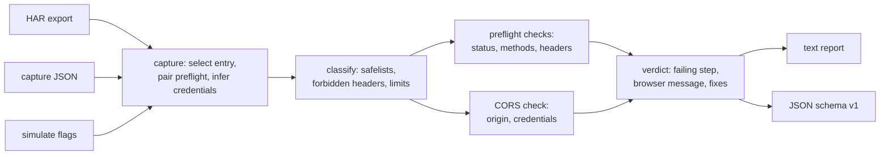

# corsdoctor

[English](README.md) | [中文](README.zh.md) | [日本語](README.ja.md)

[](LICENSE) [](go.mod) [](CHANGELOG.md)  [](CONTRIBUTING.md)

**corsdoctor：一个开源、零依赖的 CLI，精确解释 CORS 请求为什么失败——它在捕获的请求和响应之上运行 Fetch 标准的 CORS 算法，点名失败的那一步，重建浏览器控制台的报错，并给出修复方案。**


```bash
git clone https://github.com/JaydenCJ/corsdoctor && cd corsdoctor
go build -o corsdoctor ./cmd/corsdoctor    # single static binary, stdlib only
```

> 预发布：v0.1.0 尚未发布到任何包仓库；请按上面的方式从源码构建（任意 Go ≥1.22）。

## 为什么选 corsdoctor？

「Blocked by CORS policy」是 Web 开发中被搜索最多的报错，而围绕它的工具却出奇地浅。浏览器控制台只告诉你*有一项检查失败了*，却不说*是哪些输入*让它失败；`curl -v` 给你看头部，但算法仍留在你脑子里——而细节恰恰在那里出错：`Access-Control-Allow-Origin` 是和*序列化后的* origin 逐字节比较的；一旦带上凭据，`*` 就变成字面量；`PATCH` 永远不会被大写化；`Authorization` 不受头部通配符覆盖；重定向会直接杀死预检，无论它带了什么头。在线 CORS 检测站发送的是*它们自己的*实时请求，诊断的是它们的流量而不是你的。corsdoctor 拿的是真实发生过的东西——DevTools 导出的 HAR、手写的 JSON 捕获或 CLI 参数——并逐步执行浏览器所运行的同一套分类、预检和 CORS 检查算法，停在浏览器停下的地方。判定结果点名失败的具体检查并附 Fetch 标准出处，重现 Chrome 风格的控制台消息让你确认与所见一致，并打印出服务器必须发送的头部。它甚至能诊断真实请求从未发出的 HAR：从失败预检的 `Access-Control-Request-*` 头部把请求重建出来。

| | corsdoctor | 浏览器控制台 | curl -v + 肉眼 | 在线 CORS 检测站 |
|---|---|---|---|---|
| 运行真正的 Fetch CORS 算法 | ✅ | ✅（不透明） | ❌ | 部分 |
| 点名失败步骤 + 规范出处 | ✅ | ❌ | ❌ | ❌ |
| 值级别的预检分类（content-type essence、128/1024 字节上限） | ✅ | ❌ | ❌ | ❌ |
| 离线基于*你的*流量捕获工作 | ✅ | n/a | ✅ | ❌ 发它自己的 |
| 感知凭据模式（`*` 变字面量、`true` 大小写规则） | ✅ | ✅ | ❌ | 部分 |
| 从失败的预检重建请求（HAR） | ✅ | ❌ | ❌ | ❌ |
| 机器可读判定 + 供脚本用的退出码 | ✅ | ❌ | ❌ | ❌ |
| 运行时依赖 | 0 | n/a | 0 | 浏览器 + 对方服务器 |

<sub>依赖数核对于 2026-07-13：corsdoctor 只导入 Go 标准库（`go.mod` 没有 require 块）。</sub>

## 特性

- **是算法，不是头部 lint** —— 把 Fetch 的请求分类、CORS 预检和 CORS 检查实现为有名字、有顺序的步骤；判定是 `BLOCKED at preflight.allow-headers`，而不是「看起来哪里不对」。
- **值级别的预检触发器** —— 知道一个头部*为什么*触发预检：`content-type` 的 MIME essence 规则、语言字节集、单区间 `Range`、128 字节值上限与 1024 字节聚合上限，以及从不计入的浏览器专属头部。
- **结构化诊断 origin 不匹配** —— 尾部斜杠、协议、端口（含默认端口省略）、主机大小写、子域混淆，以及两层中间件各加一个 `Access-Control-Allow-Origin` 的重复头部陷阱。
- **重建浏览器报错** —— 每个 blocked 判定都附带 Chrome 风格的控制台报错，你可以与 DevTools 中看到的逐字对照，确认诊断找到的正是*你的*失败。
- **读你手头已有的东西** —— DevTools 的 HAR 导出（自动配对预检、推断凭据、重建失败预检的请求）、极简可手写的捕获 JSON，或用 `simulate` 纯参数问「如果……会怎样」。
- **给修复与隐患，不止判定** —— 具体的修复行（包括经典的「你的中间件只装饰了 OPTIONS」bug），并警告缺失的 `Vary: Origin`、放行 `null` origin、以及过期的 `Access-Control-Max-Age` 缓存。
- **零依赖、完全离线** —— 仅 Go 标准库；捕获永远不离开你的机器。没有遥测，永不联网。

## 快速上手

```bash
go build -o corsdoctor ./cmd/corsdoctor
./corsdoctor check examples/blocked-preflight-header.json
```

真实捕获输出：

```text
corsdoctor — PUT https://api.example.test/v1/items/42
  origin       https://app.example.test
  credentials  include (cookies / Authorization sent)
  class        cross-origin → preflight required

request classification
  ✗ method PUT is not CORS-safelisted (GET, HEAD, POST)
  ✓ accept: application/json — safelisted
  ✗ content-type: application/json — MIME essence "application/json" is not application/x-www-form-urlencoded, multipart/form-data, or text/plain
  ✗ x-api-key: k-123 — the name is not on the CORS safelist (accept, accept-language, content-language, content-type, range)
  → the browser sends OPTIONS first with Access-Control-Request-Headers: content-type, x-api-key

preflight response
  ✓ Access-Control-Allow-Origin is present
      Access-Control-Allow-Origin: https://app.example.test
  ✓ Access-Control-Allow-Origin matches the request origin
      byte-for-byte match with "https://app.example.test"
  ✓ Access-Control-Allow-Credentials permits credentials
      Access-Control-Allow-Credentials: true
  ✓ preflight response status is ok (2xx)
      status 204
  ✓ Access-Control-Allow-Methods covers the method
      PUT is listed (Access-Control-Allow-Methods: PUT, PATCH, DELETE)
  ✗ Access-Control-Allow-Headers covers every unsafe header
      not covered by Access-Control-Allow-Headers (content-type): x-api-key
      ref: Fetch "CORS-preflight fetch" headers check: every CORS-unsafe request-header name must be covered; "*" never covers Authorization and is literal with credentials

actual response
  – CORS check on the actual response
      the browser never sends the actual request when the preflight fails

verdict  BLOCKED at preflight.allow-headers
  not covered by Access-Control-Allow-Headers (content-type): x-api-key

browser console (Chrome-style)
  Access to fetch at 'https://api.example.test/v1/items/42' from origin 'https://app.example.test' has been blocked by CORS policy: Request header field x-api-key is not allowed by Access-Control-Allow-Headers in preflight response.

fix
  • add x-api-key to Access-Control-Allow-Headers in the preflight response
```

还没有捕获？直接问「如果……会怎样」，拿到服务器要满足的契约（`simulate`，真实输出）：

```text
$ ./corsdoctor simulate --origin https://app.example.test \
    --url https://api.example.test/items --method DELETE \
    -H 'X-Api-Key: k1' --credentials

corsdoctor — DELETE https://api.example.test/items
  origin       https://app.example.test
  credentials  include (cookies / Authorization sent)
  class        cross-origin → preflight required

request classification
  ✗ method DELETE is not CORS-safelisted (GET, HEAD, POST)
  ✗ x-api-key: k1 — the name is not on the CORS safelist (accept, accept-language, content-language, content-type, range)
  → the browser sends OPTIONS first with Access-Control-Request-Headers: x-api-key

verdict  ADVISORY
  no responses captured — listing what the server must send for this request to pass

server requirements
  • answer `OPTIONS` with a 2xx (no redirect) carrying `Access-Control-Allow-Origin: https://app.example.test` and `Access-Control-Allow-Credentials: true`
  • the preflight must list the method: `Access-Control-Allow-Methods: DELETE`
  • the preflight must cover the unsafe headers: `Access-Control-Allow-Headers: x-api-key`
  • the actual DELETE response itself needs `Access-Control-Allow-Origin: https://app.example.test` and `Access-Control-Allow-Credentials: true`
```

## CLI 参考

`corsdoctor [check|simulate|version] …` —— 裸路径等同于 `check`。退出码：0 通过/建议，1 被拦截，2 用法错误，3 捕获不完整。

| 参数 | 默认 | 作用 |
|---|---|---|
| `check <file\|->` | — | 诊断捕获 JSON 或 HAR（自动识别），或标准输入 |
| `--json` | 关 | 稳定的机器可读报告（`schema_version: 1`），含 `exit_code` |
| `--url <substring>`（check） | 第一个条目 | 选择要诊断的 HAR 条目 |
| `--credentials` / `--no-credentials` | 取自捕获 | 强制凭据模式（覆盖 HAR 推断） |
| `--origin`、`--url`（simulate） | 必填 | 发起页面的 origin 与目标 URL |
| `--method`、`-H 'Name: value'`（simulate） | `GET`、无 | 要分类的请求 |
| `--preflight-status`、`--preflight-header`（simulate） | 无 | 附上 OPTIONS 响应 |
| `--status`、`--response-header`（simulate） | 无 | 附上实际响应 |

输入格式见 [docs/capture-format.md](docs/capture-format.md)；每项检查与失败码见 [docs/checks.md](docs/checks.md)。

## 验证

本仓库不带任何 CI；以上每一条声明都由本地运行验证：

```bash
go test ./...            # 89 deterministic tests, offline, < 5 s
bash scripts/smoke.sh    # end-to-end CLI check, prints SMOKE OK
```

## 架构



## 路线图

- [x] v0.1.0 —— 忠实于 Fetch 的分类 + 预检 + CORS 检查与步骤级判定，HAR/JSON/simulate 输入，失败预检重建，Chrome 报错输出，text/JSON 报告，89 个测试 + smoke 脚本
- [ ] Private Network Access 检查（`Access-Control-Allow-Private-Network`）
- [ ] `Timing-Allow-Origin` 与 `Cross-Origin-Resource-Policy` 诊断
- [ ] `corsdoctor fix` —— 生成可直接粘贴的服务器配置（nginx、Express、Go net/http）
- [ ] 原始 HTTP 报文输入（粘贴请求/响应文本，无需 JSON）
- [ ] WebSocket 握手（`Origin` 检查）顾问

完整列表见 [open issues](https://github.com/JaydenCJ/corsdoctor/issues)。

## 参与贡献

欢迎 issue、讨论和 PR —— 本地工作流（format、vet、测试、`SMOKE OK`）见 [CONTRIBUTING.md](CONTRIBUTING.md)。入门任务标注为 [good first issue](https://github.com/JaydenCJ/corsdoctor/issues?q=is%3Aissue+is%3Aopen+label%3A%22good+first+issue%22)，设计讨论在 [Discussions](https://github.com/JaydenCJ/corsdoctor/discussions)。

## 许可证

[MIT](LICENSE)
